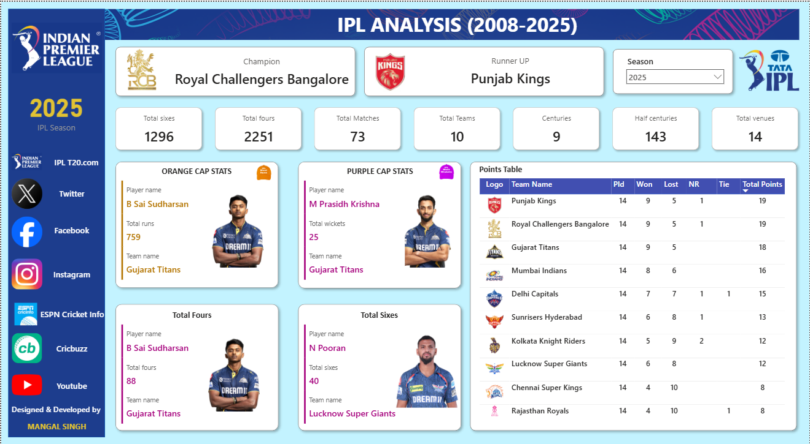

# 🏏 IPL Data Analysis Project (Power BI)

This repository contains a Power BI project focused on analyzing **Indian Premier League (IPL)** match data. It includes datasets, a Power BI dashboard, and a preview image to help visualize key metrics and insights from IPL seasons.

---

## 📂 Project Structure

- **`ipl_matches_data.csv`** – Match-level data (teams, scores, dates, venues, outcomes)  
- **`players-data-updated.csv`** – Player stats (runs, wickets, strike rates, etc.)  
- **`teams_data.csv`** – Team details & aggregated stats  
- **`IPL Data Dashboard.pbix`** – Power BI dashboard file  
- **`Dashboard.png`** – Dashboard preview image  

---

## 📊 Dashboard Preview

Here’s a quick look at the interactive Power BI dashboard:  



---

## 🚀 Features & Insights

✨ Team performance comparisons across seasons  
✨ Player performance trends (top run scorers, highest wicket-takers)  
✨ Venue-wise insights & head-to-head team analysis  
✨ Interactive filters to explore by **season**, **team**, or **player**  

---

## ⚡ Getting Started

### Requirements  
- **Microsoft Power BI Desktop** (latest version recommended)

### Instructions  
1. Clone the repository:
   ```bash
   git clone https://github.com/mangal-singh001/IPL-Data-Analysis-Project-Power-BI.git
   ````

2. Open **`IPL Data Dashboard.pbix`** in Power BI Desktop
3. Verify and update dataset paths if needed
4. Start exploring with slicers, charts, and cross-filtering 🔍

---

## 💡 How to Use the Dashboard

* Use **season filters** to track performance across IPL editions
* Click on visuals (e.g., teams/players) to dynamically update all charts
* Export charts 📤 for presentations or reports
* Explore *venue-wise* & *player-wise* insights with ease

---

## 🔮 Potential Enhancements

* Add **live data refresh** from APIs
* Include advanced metrics (win probability, strike rate trends, etc.)
* Deploy on **Power BI Service** for sharing & collaboration

---

## 🙌 Credits

* Created by **Mangal Singh**
* Built using **Microsoft Power BI** & IPL datasets

---

## 🔗 Connect with Me

* **GitHub**: [mangal-singh001](https://github.com/mangal-singh001)
* **LinkedIn**: [Mangal Singh](https://www.linkedin.com/in/mangal-singh001/)

---

⭐ If you liked this project, don’t forget to **star the repo**!

```

